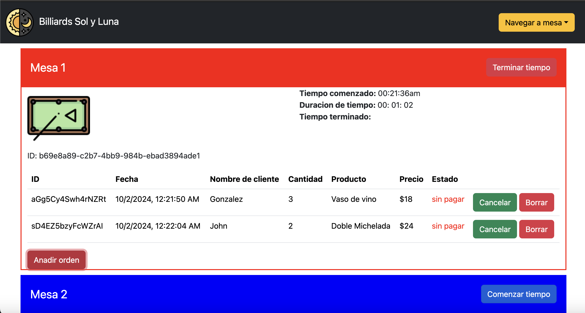
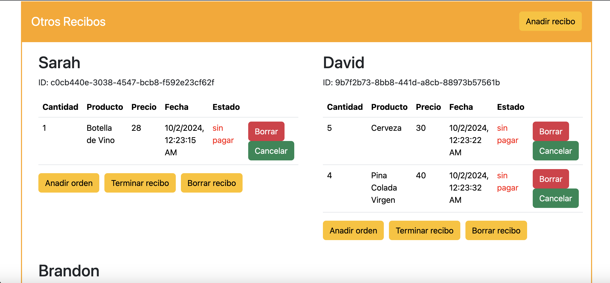
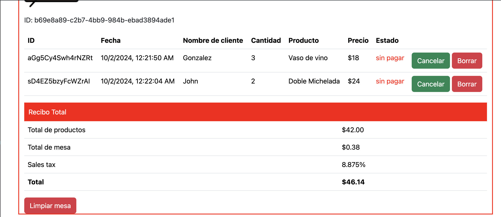
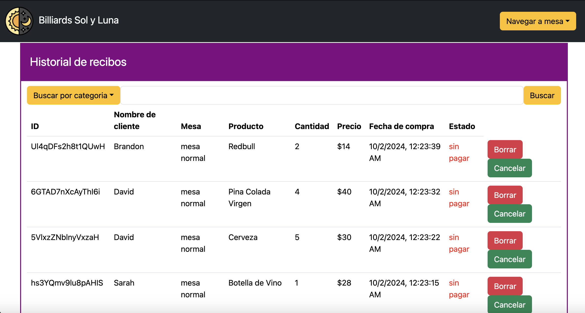
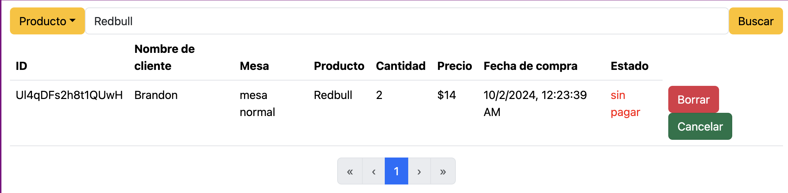

# Billiards Sol y Luna Receipt Management App V1.0

## Overview
Billiards Sol Y Luna is a bar and tavern located in Corona, NYC. The establishment caters to dozens of people per day and offers services such as beer and billiard games. Traditionally, the receipts are written in pen and paper and disputes are settled in-person with these paper receipts. However, it can be difficult to keep track of debts, payments and time elapsed playing on pool tables with memory and jotting down notes alone. Some additional charges such as tips and sales tax are not accounted for when writing paper receipts, leaving money on the table so to speak. Given the limitations of these traditional methods, I have created an offline simple receipt management desktop app that shows an overview of information such as currently open receipts, time elapsed on pool tables and past invoices. Having a desktop app that holds persistent data of past orders made and whether they are paid or in debt will help significantly to keep track of who owes what and make it easier to settle disputes with customers. The sales tax is also included in the invoices which more accurately reflects the value of the goods and services offered in Billiards Sol y Luna.

## Features
- Pool table time tracking: Clientele have the option to play on pool tables for a certain amount of time. For each pool table, there are three dates shown on the right: the start time, the time elapsed and the end time. Upon starting the game, the time it starts appears as well as the time elapsed. At the end, the end time is recorded and the total amount of time spent on the table is added onto the invoice.

- Receipt tracking: Each pool table (3 pool tables in total) has a receipt table which shows the orders made by people playing on those tables. Other receipts for people who are not playing in tables are tracked in a separate section called "other receipts". 

- Order history database: A major concern in the development of this system is finding an embedded database to store data on disk, eliminating the need to host web services. I use NeDB for its lightweight and quick setup, as well as its simple to write mongodb operations. 

- Search bar: A simple search tool for finding specific data so that the user can filter search results by keywords. You also have the option to search by categories such as client name, date of purchase, table, product and status.

## Future plans
Following the distribution of the app, some future improvements include:
- Remove refresh button: Currently, the data does automatically update for receipts and receipt history but only within the context of its own section. For example, updating and deleting records in one pool table's receipt will reflect on the receipt of that pool table automatically but such changes will not show up on the receipt history until you click on the refresh button. In the near future, I want to make it so that all changes from all parts of the app are reflected universally automatically. 
- Integrate SQLite: Currently, I am using NeDB for persistent data storage but as the system stores more data into the database, performance issues may eventually arise. Although capable of sizable datasets, NeDB may eventually struggle if the dataset grows too large. I will be looking into using SQLite to rewrite the backend for when performance issues arise. 
- Add performance metrics: Another tab that shows the total monthly gains of the establishment with data visualizations showing data such as most popular drinks.
- Sorting functions: Currently, the database sorts the retrieved data by date in the backend but I will also add sorting functions to handle sorting by different categories, creating a more flexible searching experience.

## Tech stack

### Frontend
- HTML
- CSS + React Bootstrap 
- JSX
- React.js
### Backend
- NeDB

I used Electron.js to make this project a desktop app and capable of running offline.